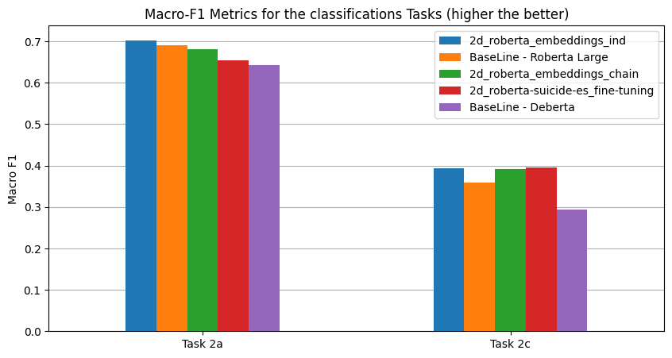
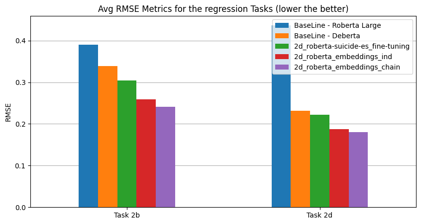

A Framework for Identifying Depression on Social Media
==============================

This repository contains the code for the paper:  **A Framework for Identifying Depression on Social Media: MentalRiskES@IberLEF 2023** was submitted to the proceedings of the [IberLEF 2023](https://sites.google.com/view/iberlef-2023/home) evaluation campaign of Natural Language Processing (NLP) tools for Spanish. In the paper we describe our participation in Task 2 of the MentalRiskES competition, which evaluated systems for the early-risk detection of depression from Telegram conversations. 

## Abstract of the paper: 

> This paper describes our participation in the MentalRiskES task at IberLEF 2023. The task involved
predicting the likelihood of an individual experiencing depression based on their social media activity.
The dataset consisted of conversations from 175 Telegram users, each labeled according to their evi-
dence of suffering from the disorder. We used a combination of traditional machine learning and deep
learning techniques to solve four predictive subtasks: binary classification, simple regression, multiclass
classification, and multiclass regression. The best results were obtained by training a model to solve the
multiclass regression case and then transforming the predictions to work for the other three subtasks.
We compare the performance of two different modeling approaches: fine-tuning a BERT-based model,
and using sentence embeddings as inputs to a linear regressor, with the latter yielding better results

## Results

The metrics are shown along with the name of the model used to obtain them. The models
are named as: *[task name]_[model name]_[approach]*. For example, task2b_roberta-suicide-es_fine-tuning refers to the model trained with the task 2b (binary classification) labels by fine-tuning the Roberta model pre-trained for suicide detection. The "approach" can be either embeddings or fine-tuning for the two approaches we experimented with as decribed in Section 3 of the paper. 

The results show that the approaches considered in our work were successful at modeling each
of the predictive subtasks with at least one of our models outperforming the baselines in most cases. Refer to the "Results" and "Conclusions" sections of the paper for a better discussion of these results.